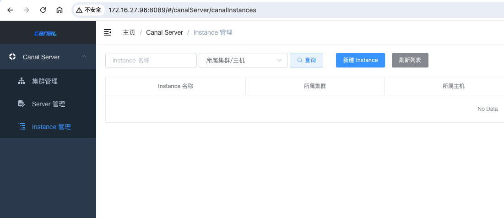

# [Canal](https://github.com/alibaba/canal?spm=a2c6h.12873639.article-detail.9.487a78a372zvnx)

## [快速安装](https://github.com/alibaba/canal)


- **Canal Admin**: Canal Admin 是一个提供整体配置管理、节点运维等面向运维的功能的组件，它提供了一个友好的 Web UI 操作界面，方便用户快速和安全地进行操作和管理。它允许用户通过图形界面管理 Canal 服务的配置参数，动态启停 Server 和 Instance，以及查看日志信息。

- **Canal Deployer** : Canal Deployer 是 Canal 的部署组件，它负责启动 Canal Server 实例，监控和管理 Canal 的运行状态。它模拟 MySQL slave 的交互协议，伪装自己为 MySQL slave，接收主服务器的 binary log 事件，并提供给订阅者。

- **Canal Adapter** : Canal Adapter 是 Canal 的数据适配器组件，用于将解析到的数据进行 ETL 处理，然后同步到其他数据源或数据存储中，如 Elasticsearch、HBase、RDB 等。它通过 SPI（Service Provider Interface）机制加载适配器，实现数据的转换和同步。

### docker 安装

所需文件地址:  https://github.com/withlin/canal-go/tree/master/docker

```dockerfile
version: '3.1'

services:
  mysql:
    image: mysql:8.0
    container_name: mysql-8.0
    ports:
      - "4406:3306"
    environment:
      - MYSQL_ROOT_PASSWORD=000000
    networks:
      - canalsharp
    volumes:
      - ./mysql/mysqld.cnf:/etc/mysql/mysql.conf.d/mysqld.cnf
      - ./var/lib/mysql:/var/lib/mysql
      - ./mysql/init/:/docker-entrypoint-initdb.d/

    
  canal-server:
    image: canal/canal-server:v1.1.7
    container_name: canal-server
    ports:
      - "11111:11111"
    networks:
      - canalsharp
    volumes:
      - ./example/:/home/admin/canal-server/conf/example/
      - ./canal-server-logs/:/home/admin/canal-server/logs/
    depends_on:
      - mysql

networks:

  canalsharp:
    driver: bridge
```

启动容器

```shell
docker-compose up -d
```

### [源码安装](https://github.com/alibaba/canal/releases)

这里一定要先开启 mysql 的 binlog

```shell
[root@vrg-01 ~]# vim /etc/my.cnf
```

```
server-id=1
log-bin=mysql-bin
binlog_format=row
```

重启 mysql 

```shell
[root@vrg-01 ~]# systemctl restart mysqld
```

执行 sql 确认下状态

```
mysql> show VARIABLES like "%bin%"
```


进行安装配置

```shell
[root@vrg-01 ~]# wget https://github.com/alibaba/canal/releases/download/canal-1.1.8-alpha-1/canal.deployer-1.1.8-SNAPSHOT.tar.gz


[root@vrg-01 ~]# mkdir /usr/local/canal


[root@vrg-01 ~]# tar -zxvf canal.deployer-1.1.8-SNAPSHOT.tar.gz -C /usr/local/canal/
```

修改配置文件

```shell
[root@vrg-01 conf]# pwd
/usr/local/canal
```

 `     vim conf/example/instance.properties      `    , master.address填数据库地址,dbUsername和dbPassword是数据库账号,flter.regex可以用来过滤数据库，默认是监听所有数据库,如果想监听db_开头的数据可以这么写db_.*\\..*,多个用逗号分隔

```
#################################################
## mysql serverId , v1.0.26+ will autoGen
# canal.instance.mysql.slaveId=0

# enable gtid use true/false
canal.instance.gtidon=false

# position info
canal.instance.master.address=127.0.0.1:3306
canal.instance.master.journal.name=
canal.instance.master.position=
canal.instance.master.timestamp=
canal.instance.master.gtid=

# rds oss binlog
canal.instance.rds.accesskey=
canal.instance.rds.secretkey=
canal.instance.rds.instanceId=

# table meta tsdb info
canal.instance.tsdb.enable=true
#canal.instance.tsdb.url=jdbc:mysql://127.0.0.1:3306/canal_tsdb
#canal.instance.tsdb.dbUsername=canal
#canal.instance.tsdb.dbPassword=canal

#canal.instance.standby.address =
#canal.instance.standby.journal.name =
#canal.instance.standby.position =
#canal.instance.standby.timestamp =
#canal.instance.standby.gtid=

# username/password
canal.instance.dbUsername=canal
canal.instance.dbPassword=canal
canal.instance.connectionCharset = UTF-8
# enable druid Decrypt database password
canal.instance.enableDruid=false
#canal.instance.pwdPublicKey=MFwwDQYJKoZIhvcNAQEBBQADSwAwSAJBALK4BUxdDltRRE5/zXpVEVPUgunvscYFtEip3pmLlhrWpacX7y7GCMo2/JM6LeHmiiNdH1FWgGCpUfircSwlWKUCAwEAAQ==

# table regex
canal.instance.filter.regex=.*\\..*
# table black regex
canal.instance.filter.black.regex=mysql\\.slave_.*
# table field filter(format: schema1.tableName1:field1/field2,schema2.tableName2:field1/field2)
#canal.instance.filter.field=test1.t_product:id/subject/keywords,test2.t_company:id/name/contact/ch
# table field black filter(format: schema1.tableName1:field1/field2,schema2.tableName2:field1/field2)
#canal.instance.filter.black.field=test1.t_product:subject/product_image,test2.t_company:id/name/contact/ch

# mq config
canal.mq.topic=example
# dynamic topic route by schema or table regex
#canal.mq.dynamicTopic=mytest1.user,topic2:mytest2\\..*,.*\\..*
canal.mq.partition=0
# hash partition config
#canal.mq.enableDynamicQueuePartition=false
#canal.mq.partitionsNum=3
#canal.mq.dynamicTopicPartitionNum=test.*:4,mycanal:6
#canal.mq.partitionHash=test.table:id^name,.*\\..*
#
# multi stream for polardbx
canal.instance.multi.stream.on=false
#################################################
```

`       vim conf/canal.properties        `, 其中canal.port是客户端连接的端口，需要放开,canal.admin.user和canal.admin.passwd是客户端连接的账号

```
#################################################
#########               common argument         #############
#################################################
# tcp bind ip
canal.ip = 172.16.27.96
# register ip to zookeeper
canal.register.ip = 172.16.27.96
canal.port = 11111
canal.metrics.pull.port = 11112
# canal instance user/passwd
# canal.user = canal
# canal.passwd = 

# canal admin config
#canal.admin.manager = 127.0.0.1:8089
canal.admin.port = 11110
canal.admin.user = admin
canal.admin.passwd = 4ACFE3202A5FF5CF467898FC58AAB1D615029441
# admin auto register
canal.admin.register.auto = true
canal.admin.register.cluster =
canal.admin.register.name =
```

启动 canal

```shell
[root@master2 canal]# bin/startup.sh 

[root@master2 canal]# jps
19840 CanalLauncher
20876 Jps
```

也可以看下日志文件

```shell
[root@master2 canal]# tail -f logs/example/example.log 
// ......
2024-06-03 03:57:16.730 [destination = example , address = /127.0.0.1:3306 , EventParser] WARN  c.a.otter.canal.parse.inbound.mysql.MysqlConnection - load MySQL @@version_comment : MySQL Community Server (GPL)
2024-06-03 03:57:19.590 [destination = example , address = /127.0.0.1:3306 , EventParser] WARN  c.a.o.c.p.inbound.mysql.rds.RdsBinlogEventParserProxy - ---> find start position successfully, EntryPosition[included=false,journalName=mysql-bin.000001,position=4,serverId=1,gtid=<null>,timestamp=1717401429000] cost : 2832ms , the next step is binlog dump
2024-06-03 03:57:19.658 [destination = example , address = /127.0.0.1:3306 , EventParser] WARN  c.a.otter.canal.parse.inbound.mysql.MysqlConnection - load MySQL @@version_comment : MySQL Community Server (GPL)
```

这里在 UI 中添加下服务即可


### [Canal UI](https://github.com/alibaba/canal/releases/tag/canal-1.1.7)

这里 mysql 使用 5.7 版本的, java 版本为 8

```sql
select VERSION();

VERSION
5.7.39
```

```shell
[root@master2 canal_admin]# java -version
openjdk version "1.8.0_412"
OpenJDK Runtime Environment (build 1.8.0_412-b08)
OpenJDK 64-Bit Server VM (build 25.412-b08, mixed mode)
```

确保你的服务器上安装了 Java 环境，`Canal v1.1.7 推荐使用 JDK 8，也兼容 JDK 11，但 JDK 17 可能会有问题`。 其次 mysql 可以选择使用 8.* 以上的版本

使用 root 账户创建一个 canal 用户

```sql
set global validate_password_length=0;
set global validate_password_policy=LOW;

GRANT ALL ON*.* TO 'canal'@'%' IDENTIFIED BY 'canal';
flush PRIVILEGES;
```

安装 canal_admin

```shell
[root@master2 root]# wget https://github.com/alibaba/canal/releases/download/canal-1.1.7/canal.admin-1.1.7.tar.gz


[root@master2 root]# mkdir /usr/local/canal_admin ; tar -zxvf  canal.admin-1.1.7.tar.gz -C /usr/local/canal_admin/

[root@master2 root]# cd /usr/local/canal_admin; vim conf/application.yml 
```

```yaml
server:
  port: 8089
spring:
  jackson:
    date-format: yyyy-MM-dd HH:mm:ss
    time-zone: GMT+8

spring.datasource:
  # 这里设置 mysql 连接信息
  address: 127.0.0.1:3306
  database: canal_manager
  username: canal
  password: canal
  driver-class-name: com.mysql.jdbc.Driver
  url: jdbc:mysql://${spring.datasource.address}/${spring.datasource.database}?useUnicode=true&characterEncoding=UTF-8&useSSL=false
  hikari:
    maximum-pool-size: 30
    minimum-idle: 1

canal:
  adminUser: admin
  adminPasswd: admin
```

这里执行 sql 文件,  在 `conf/canal_manager.sql`

```sql
CREATE DATABASE /*!32312 IF NOT EXISTS*/ `canal_manager` /*!40100 DEFAULT CHARACTER SET utf8 COLLATE utf8_bin */;

USE `canal_manager`;

SET NAMES utf8;
SET FOREIGN_KEY_CHECKS = 0;

-- ----------------------------
-- Table structure for canal_adapter_config
-- ----------------------------
DROP TABLE IF EXISTS `canal_adapter_config`;
CREATE TABLE `canal_adapter_config` (
  `id` bigint(20) NOT NULL AUTO_INCREMENT,
  `category` varchar(45) NOT NULL,
  `name` varchar(45) NOT NULL,
  `status` varchar(45) DEFAULT NULL,
  `content` text NOT NULL,
  `modified_time` timestamp NOT NULL DEFAULT CURRENT_TIMESTAMP ON UPDATE CURRENT_TIMESTAMP,
  PRIMARY KEY (`id`)
) ENGINE=InnoDB DEFAULT CHARSET=utf8;

-- ----------------------------
-- Table structure for canal_cluster
-- ----------------------------
DROP TABLE IF EXISTS `canal_cluster`;
CREATE TABLE `canal_cluster` (
  `id` bigint(20) NOT NULL AUTO_INCREMENT,
  `name` varchar(63) NOT NULL,
  `zk_hosts` varchar(255) NOT NULL,
  `modified_time` timestamp NOT NULL DEFAULT CURRENT_TIMESTAMP ON UPDATE CURRENT_TIMESTAMP,
  PRIMARY KEY (`id`)
) ENGINE=InnoDB DEFAULT CHARSET=utf8;

-- ----------------------------
-- Table structure for canal_config
-- ----------------------------
DROP TABLE IF EXISTS `canal_config`;
CREATE TABLE `canal_config` (
  `id` bigint(20) NOT NULL AUTO_INCREMENT,
  `cluster_id` bigint(20) DEFAULT NULL,
  `server_id` bigint(20) DEFAULT NULL,
  `name` varchar(45) NOT NULL,
  `status` varchar(45) DEFAULT NULL,
  `content` text NOT NULL,
  `content_md5` varchar(128) NOT NULL,
  `modified_time` timestamp NOT NULL DEFAULT CURRENT_TIMESTAMP ON UPDATE CURRENT_TIMESTAMP,
  PRIMARY KEY (`id`),
  UNIQUE KEY `sid_UNIQUE` (`server_id`)
) ENGINE=InnoDB DEFAULT CHARSET=utf8;

-- ----------------------------
-- Table structure for canal_instance_config
-- ----------------------------
DROP TABLE IF EXISTS `canal_instance_config`;
CREATE TABLE `canal_instance_config` (
  `id` bigint(20) NOT NULL AUTO_INCREMENT,
  `cluster_id` bigint(20) DEFAULT NULL,
  `server_id` bigint(20) DEFAULT NULL,
  `name` varchar(45) NOT NULL,
  `status` varchar(45) DEFAULT NULL,
  `content` text NOT NULL,
  `content_md5` varchar(128) DEFAULT NULL,
  `modified_time` timestamp NOT NULL DEFAULT CURRENT_TIMESTAMP ON UPDATE CURRENT_TIMESTAMP,
  PRIMARY KEY (`id`),
  UNIQUE KEY `name_UNIQUE` (`name`)
) ENGINE=InnoDB DEFAULT CHARSET=utf8;

-- ----------------------------
-- Table structure for canal_node_server
-- ----------------------------
DROP TABLE IF EXISTS `canal_node_server`;
CREATE TABLE `canal_node_server` (
  `id` bigint(20) NOT NULL AUTO_INCREMENT,
  `cluster_id` bigint(20) DEFAULT NULL,
  `name` varchar(63) NOT NULL,
  `ip` varchar(63) NOT NULL,
  `admin_port` int(11) DEFAULT NULL,
  `tcp_port` int(11) DEFAULT NULL,
  `metric_port` int(11) DEFAULT NULL,
  `status` varchar(45) DEFAULT NULL,
  `modified_time` timestamp NOT NULL DEFAULT CURRENT_TIMESTAMP ON UPDATE CURRENT_TIMESTAMP,
  PRIMARY KEY (`id`)
) ENGINE=InnoDB DEFAULT CHARSET=utf8;

-- ----------------------------
-- Table structure for canal_user
-- ----------------------------
DROP TABLE IF EXISTS `canal_user`;
CREATE TABLE `canal_user` (
  `id` bigint(20) NOT NULL AUTO_INCREMENT,
  `username` varchar(31) NOT NULL,
  `password` varchar(128) NOT NULL,
  `name` varchar(31) NOT NULL,
  `roles` varchar(31) NOT NULL,
  `introduction` varchar(255) DEFAULT NULL,
  `avatar` varchar(255) DEFAULT NULL,
  `creation_date` timestamp NOT NULL DEFAULT CURRENT_TIMESTAMP ON UPDATE CURRENT_TIMESTAMP,
  PRIMARY KEY (`id`)
) ENGINE=InnoDB DEFAULT CHARSET=utf8;

SET FOREIGN_KEY_CHECKS = 1;

-- ----------------------------
-- Records of canal_user
-- ----------------------------
BEGIN;
INSERT INTO `canal_user` VALUES (1, 'admin', '6BB4837EB74329105EE4568DDA7DC67ED2CA2AD9', 'Canal Manager', 'admin', NULL, NULL, '2024-06-03 00:15:28');
COMMIT;

SET FOREIGN_KEY_CHECKS = 1;
```

```mysql
mysql -h127.1 -uwill -padmin@123

mysql> source /usr/local/canal_admin/conf/canal_manager.sql
```

启动 canal 

```shell
[root@master2 root]# ./bin/startup.sh 


[root@master2 root]# ./bin/restart.sh 


[root@master2 root]# ./bin/stop.sh 
```

访问: http://172.16.27.96:8089/ ,  默认密码：admin/123456



#### 编写一个快速启停的脚本

```shell
#! /bin/bash
case $1 in
"start"){
  /usr/local/canal/bin/startup.sh
  sleep 1
  /usr/local/canal_admin/bin/startup.sh
} ;;
"stop"){
  /usr/local/canal/bin/stop.sh
  sleep 1
  /usr/local/canal_admin/bin/stop.sh
} ;;
esac
```

```shell
[root@master2 ~]# mv canal.sh  /bin/

[root@master2 ~]# canal.sh stop
[root@master2 ~]# canal.sh start

[root@master2 ~]# jps
22627 CanalAdminApplication
22645 Jps
22585 CanalLauncher
```

### 高可用


##  Canal的工作原理


MySQL的 Binlog 日志可以说MySQL最重要的日志了，它记录了所有的DDL和DML(除了数据查询语句)语句，以事件形式记录，还包含语句所执行的消耗的时间，MySQL的二进制日志是事务安全型的。

一般来说开启二进制日志大概会有1%的性能损耗。二进制有两个最重要的使用场景: 

- MySQL Replication在 Master 端开启 Binlog，Master 把它的二进制日志传递给 Slaves 来达到Master-Slave数据一致的目的。

- 自然就是数据恢复了，通过使用MySQL Binlog工具来使恢复数据。

**二进制日志包括两类文件：**

- 二进制日志索引文件（文件名后缀为.index）用于记录所有的二进制文件
- 二进制日志文件（文件名后缀为.00000*）记录数据库所有的DDL和DML(除了数据查询语句)语句事件。


MySQL Binlog 的格式有三种，分别是 `STATEMENT`,  `MIXED`,  `ROW`。在配置文件中可以选择配置 `binlog_format= statement|mixed|row`。三种格式的区别： 

statement：

> 语句级，binlog会记录每次一执行写操作的语句。相对row模式节省空间，但是可能产生不一致性，比如“update  tt set create_date=now()”，如果用binlog日志进行恢复，由于执行时间不同可能产生的数据就不同。

- 优点：节省空间。

- 缺点：有可能造成数据不一致。

row：

> 行级， binlog会记录每次操作后每行记录的变化。

- 优点：保持数据的绝对一致性。因为不管sql是什么，引用了什么函数，他只记录执行后的效果。

- 缺点：占用较大空间。

mixed：

> statement的升级版，一定程度上解决了，因为一些情况而造成的statement模式不一致问题，默认还是statement，在某些情况下譬如：当函数中包含 UUID() 时；包含 AUTO_INCREMENT 字段的表被更新时； 

- 优点：节省空间，同时兼顾了一定的一致性。

- 缺点：还有些极个别情况依旧会造成不一致，另外 `statement` 和 `mixed`对于需要对 `binlog` 的监控的情况都不方便。

### MySQL 主从复制原理

- Master 主库将改变记录，写到二进制日志(Binary Log)中；

- Slave 从库向 MySQL Master 发送 dump 协议，将 Master 主库的 binary log events 拷贝到它的中继日志(relay log)；
- Slave 从库读取并重做中继日志中的事件，将改变的数据同步到自己的数据库。


canal 就是把自己伪装成了 slave 进行工作的

```shell
[root@master2 canal]# cd conf
[root@master2 conf]# tree
.
├── canal_local.properties
├── canal.properties
├── example
│   ├── h2.mv.db
│   └── instance.properties
├── logback.xml
├── metrics
// .....
```

这里有几个关键的配置文件信息

**instance.properties**：

- 这个文件用于定义 Canal 实例的配置信息。
- 实例是 Canal 中的一个核心概念，每个实例可以看作是一个独立的数据同步通道。
- 配置信息通常包括 MySQL 数据库的连接信息（如地址、端口、用户名、密码等），以及 Canal 抓取 binlog 的起始位置等。

````
# mysql serverId , v1.0.26+ will autoGen

# 数据库地址
canal.instance.master.address=127.0.0.1:3306

# binlog日志名称
canal.instance.master.journal.name=mysql-bin.000001

# mysql主库链接时起始的binlog偏移量
canal.instance.master.position=154

# mysql主库链接时起始的binlog的时间戳
canal.instance.master.timestamp=
canal.instance.master.gtid=

# 在MySQL服务器授权的账号密码
canal.instance.dbUsername=canal
canal.instance.dbPassword=Canal@123456

# 字符集
canal.instance.connectionCharset=UTF-8
# enable druid Decrypt database password
canal.instance.enableDruid=false

# table regex .*\\..*表示监听所有表 也可以写具体的表名，用，隔开
# canal.instance.filter.regex=vrpm\.instance,vda\.order
canal.instance.filter.regex=.*\\..*


# mysql 数据解析表的黑名单，多个表用，隔开
canal.instance.filter.black.regex=
````

**canal.properties**：

- 这个文件用于定义 Canal 服务本身的全局配置。
- 这包括 Canal 服务的端口、日志配置、ZooKeeper 集群地址（如果使用 ZooKeeper 进行集群管理）等。

```
canal.admin.port：Canal Admin 管理端口。
canal.port：Canal Server 提供 socket 服务的端口。
canal.zkServers：链接到 ZooKeeper 集群的地址。
```

**Canal Admin 管理后台密码**：

Canal Admin 的密码加密方式是使用 MySQL 的 `password()` 函数生成的密文。这个函数生成的是一个散列值，用于在 MySQL 中存储密码。

- 生成密文的步骤如下：

  - 登录到 MySQL 数据库。

  - 执行 SQL 语句来生成密码的散列值，例如：

    ```mysql
    set global validate_password_length=0;
    set global validate_password_policy=LOW;
    
    SELECT PASSWORD('123456'); // 6BB4837EB74329105EE4568DDA7DC67ED2CA2AD9
    SELECT PASSWORD('admin'); // 4ACFE3202A5FF5CF467898FC58AAB1D615029441
    ```

- 这样配置后，Canal Server 会使用这个加密后的密码与 Canal Admin 进行通信，确保安全性。


## 实战案例

```go
package canal

import (
	"fmt"
	"log"
	"os"
	"testing"
	"time"

	"github.com/withlin/canal-go/client"
	pbe "github.com/withlin/canal-go/protocol/entry"
	"google.golang.org/protobuf/proto"
)

func TestCanal(t *testing.T) {
	// example 替换成-e canal.destinations=example 你自己定义的名字
  // [root@master2 canal]# cat conf/canal.properties | grep "canal.destinations"
canal.destinations = example
	connector := client.NewSimpleCanalConnector("172.16.27.96", 11111, "", "", "example", 60000, 60*60*1000)
	err := connector.Connect()
	if err != nil {
		log.Println(err)
		os.Exit(1)
	}

  // 定义你要监控的表名
	err = connector.Subscribe(".*\\..*")
	if err != nil {
		log.Println(err)
		os.Exit(1)
	}

	for {
		message, err := connector.Get(100, nil, nil)
		if err != nil {
			log.Println(err)
			os.Exit(1)
		}
		batchId := message.Id
		if batchId == -1 || len(message.Entries) <= 0 {
			time.Sleep(300 * time.Millisecond)
			//fmt.Println("===没有数据了===")
			continue
		}

		printEntry(message.Entries)

	}
}

func printEntry(entrys []pbe.Entry) {
	for _, entry := range entrys {
		if entry.GetEntryType() == pbe.EntryType_TRANSACTIONBEGIN || entry.GetEntryType() == pbe.EntryType_TRANSACTIONEND {
			continue
		}
		rowChange := new(pbe.RowChange)

		err := proto.Unmarshal(entry.GetStoreValue(), rowChange)
		checkError(err)
		if rowChange != nil {
			eventType := rowChange.GetEventType()
			header := entry.GetHeader()
			fmt.Println(fmt.Sprintf("================> binlog[%s : %d],name[%s,%s], eventType: %s", header.GetLogfileName(), header.GetLogfileOffset(), header.GetSchemaName(), header.GetTableName(), header.GetEventType()))

			for _, rowData := range rowChange.GetRowDatas() {
				if eventType == pbe.EventType_DELETE {
					printColumn(rowData.GetBeforeColumns())
				} else if eventType == pbe.EventType_INSERT {
					printColumn(rowData.GetAfterColumns())
				} else {
					fmt.Println("-------> before")
					printColumn(rowData.GetBeforeColumns())
					fmt.Println("-------> after")
					printColumn(rowData.GetAfterColumns())
				}
			}
		}
	}
}

func printColumn(columns []*pbe.Column) {
	for _, col := range columns {
		fmt.Println(fmt.Sprintf("%s : %s  update= %t", col.GetName(), col.GetValue(), col.GetUpdated()))
	}
}

func checkError(err error) {
	if err != nil {
		fmt.Fprintf(os.Stderr, "Fatal error: %s", err.Error())
		os.Exit(1)
	}
}
```


### 同步 Redis


### 同步 kafka


### 同步 ES


